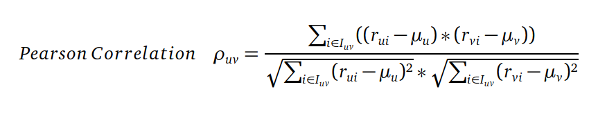
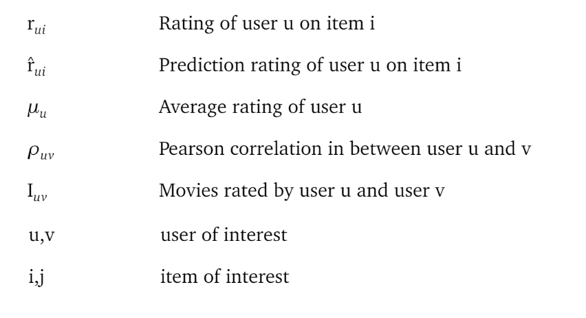

<h1 align="center">Pearson Correlation Coefficient Calculation Using Hadoop Map Reduce</h1>

First I suggest you to understand [Map Reduce 1-4 Notes](https://github.com/katipogluMustafa/BigData/tree/master/01_MapReduce) in order to really comprehend this code.

## Step 1
In step1, we calculate MovieRatings data which consists of `movieId, hashmap<userId,rating>`

## Step 2

In step2, we calculate average rating of each user.

## Step 3

In step3, we calculate the pearson correlation in between every user by using the following formula.

